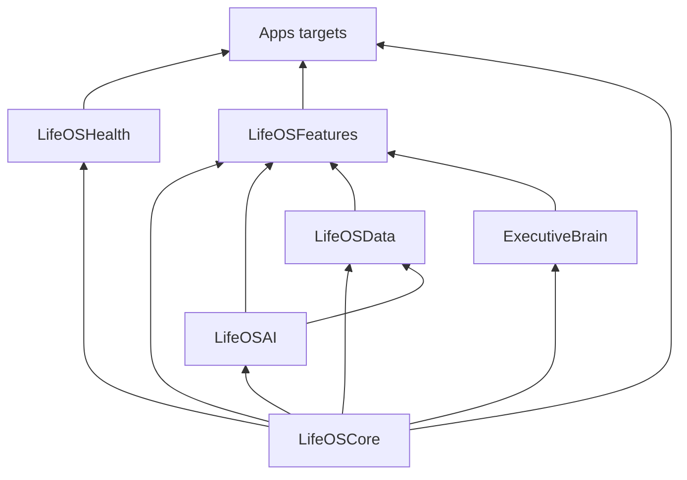

# Package Dependencies

## Graph

## Layering rules

1. **LifeOSCore** — no dependencies on other LifeOS packages
2. **LifeOSAI, LifeOSData, LifeOSHealth, ExecutiveBrain** — depend on Core only (Data also depends on AI for test targets)
3. **LifeOSFeatures** — integrates Core, AI, Data, ExecutiveBrain
4. **Apps** — depend on Features, Core, Health, and platform frameworks

## Decoupling notes

- `CognitiveModel` lives in **LifeOSCore** so LifeOSData analytics does not import LifeOSAI
- `LLMPlanningEngine` (Features) is distinct from `PlanningEngine` (ExecutiveBrain)
- Persistence consolidation (Core/EB stores → LifeOSData) is documented in [future-work.md](../future-work.md)

## ADRs

Historical decisions: [adr/](adr/)
