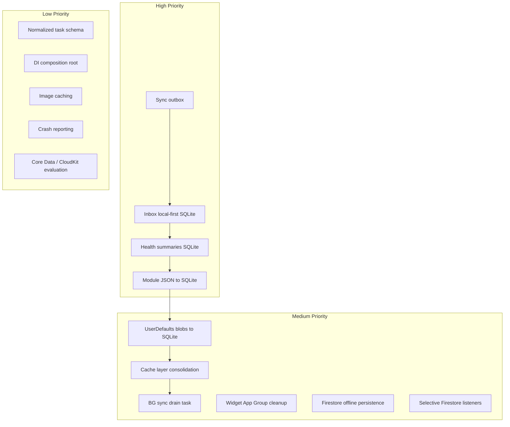

# Mobile Infrastructure Roadmap

Plan to bring Look-After’s persistence, sync, and state layers up to production mobile industry standards.

**Status:** Living document  
**Last updated:** 2026-08-08  
**Related:** [future-work.md](../future-work.md), [ADR index](./adr/)

---

## Context

Tasks recently migrated from `tasks.json` to on-device SQLite (GRDB) via `TaskSQLiteStore`. That improves local write performance and durability for one entity. Most of the app still uses patterns that do not scale or survive offline/sync failures well.

This roadmap covers **high**, **medium**, and **low** priority upgrades. It is ordered for incremental delivery — each phase should ship independently without blocking the next.

### What this roadmap fixes

| Problem class | Example symptoms |
|---------------|------------------|
| Silent sync loss | Edits disappear after reconnect; cloud never receives update |
| Offline gaps | Inbox/capture fails without network |
| Performance | Full-file JSON rewrites on every save |
| Stale UI | Multiple cache layers disagree after batch sync |
| Multi-device lag | Second device stale until manual refresh |

### What this roadmap does **not** fix

Schedule display bugs (e.g. **12:00 AM midnight**, Gym/Dinner overlap, recurrence thrashing) are **logic-layer** issues in scheduling and timeline code — not storage. Track those separately in schedule/recurrence work; storage upgrades complement but do not replace those fixes.

---

## Current state (baseline)

### Done

| Item | Location |
|------|----------|
| Tasks on SQLite (GRDB) | `Packages/LookAfterData/.../Persistence/TaskSQLiteStore.swift` |
| One-time `tasks.json` migration | Same file |
| Local-first task writes | `TaskRepository` |
| Keychain for API secrets | `LookAfterAI/.../Security/KeychainStore.swift` |
| App Group widget snapshot | `LookAfterCore/.../Storage/AppGroupWidgetStore.swift` |
| Capture offline queue | `LookAfterFeatures/.../Capture/CaptureOfflineQueue.swift` |
| BGTasks (notifications, telemetry) | `BackgroundNotificationRefreshTask`, `BehavioralTelemetryBackgroundTask` |

### Still legacy

| Storage | Files / consumers |
|---------|-------------------|
| JSON via `LocalPersistenceManager` | `health_summaries`, `bills`, `shopping_items`, `relationships`, `journal_entries`, `analytics_cache_{userId}`, `pending_captures` |
| JSON in Application Support | `behavioral_vault`, telemetry, cascade logs, parked queue, someday vault, briefing cache |
| UserDefaults blobs | medications, life model, profile, deletion tombstones, resume snapshots, habit completions |
| Cloud-only (no local cache) | `InboxRepository`, `EnergyReportRepository` |
| Firestore | Pull-only (`getDocuments`); no listeners; failed pushes not retried |

---

## Priority tiers



---

## High priority

### H1. Firestore sync outbox (generic)

**Why:** Industry standard for offline-first apps. Today, failed Firestore writes are fire-and-forget (`catch { /* can retry later */ }`) with no actual retry. This is the single biggest reliability gap.

**Goal:** Durable queue for all cloud mutations; automatic retry with backoff; drain on connectivity and in background.

**Design sketch:**

```sql
CREATE TABLE sync_outbox (
  id TEXT PRIMARY KEY,
  entity_type TEXT NOT NULL,       -- task, inbox, health, bill, ...
  entity_id TEXT NOT NULL,
  operation TEXT NOT NULL,         -- create, update, delete
  payload BLOB,                    -- encoded entity or patch
  attempts INTEGER NOT NULL DEFAULT 0,
  next_retry_at REAL NOT NULL,
  created_at REAL NOT NULL,
  last_error TEXT
);
CREATE INDEX idx_outbox_next_retry ON sync_outbox(next_retry_at);
```

**Implementation steps:**

1. Add `SyncOutboxStore` (GRDB) in `LookAfterData/Persistence/`
2. Add `SyncOutboxProcessor` — reads due rows, calls existing Firestore encode paths, marks success/failure
3. Exponential backoff: 1m → 5m → 15m → 1h cap; max attempts before user-visible error badge
4. Hook `TaskRepository.syncTaskToFirestore`, module repo pushes, health push to enqueue instead of bare `Task {}`
5. Drain triggers: app foreground, `NWPathMonitor` connectivity, BG task (see M3)
6. Tests: enqueue → simulated failure → retry → success; idempotency on duplicate push

**Files to touch:**

- `Packages/LookAfterData/Sources/LookAfterData/Repositories/Repositories.swift`
- `Packages/LookAfterData/Sources/LookAfterData/Repositories/ModuleRepositories.swift`
- New: `SyncOutboxStore.swift`, `SyncOutboxProcessor.swift`

**Success criteria:**

- Airplane mode: create task → goes local + outbox row → online → appears in Firestore within 60s
- No silent drop on transient Firestore errors
- Factory reset clears outbox

**Effort:** ~3–5 days  
**Depends on:** Tasks SQLite (done)

---

### H2. Inbox local-first (SQLite)

**Why:** `InboxRepository` is cloud-only today. Offline capture and fast inbox open are expected in production apps.

**Goal:** Inbox items persist locally in SQLite; reads hit local DB first; writes go local + outbox (H1).

**Design sketch:**

- Table `inbox_items` — JSON blob + indexed `user_id`, `created_at`, `is_processed`
- `InboxRepository`: mirror `TaskRepository` pattern (warm cache optional, local CRUD, merge on pull)

**Implementation steps:**

1. Add `InboxSQLiteStore` or extend shared `LookAfterDatabase` with inbox table
2. Refactor `InboxRepository` to local-first CRUD
3. Wire Firestore sync through outbox (H1)
4. Update `CaptureRouter` / `InboxViewModel` — no behavior change except offline works
5. One-time migration: pull from Firestore on first open if local empty and authenticated
6. Tests: offline create, kill app, relaunch → item still present

**Files to touch:**

- `Packages/LookAfterData/Sources/LookAfterData/Repositories/Repositories.swift` (`InboxRepository`)
- `Packages/LookAfterFeatures/Sources/LookAfterFeatures/Capture/CaptureRouter.swift`
- `Apps/LookAfter-iOS/Views/Inbox/InboxView.swift`

**Success criteria:**

- Inbox usable offline
- Capture → inbox works without network
- Multi-device: pull merge + optional listener (M6)

**Effort:** ~2–4 days  
**Depends on:** H1 (recommended), or inline retry as interim

---

### H3. Health summaries → SQLite

**Why:** `health_summaries.json` is rewritten wholesale; health drives timeline, briefing, and analytics. High read/write churn.

**Goal:** Same pattern as tasks — GRDB store, JSON blob per row, indexed `user_id`, `date`, `updated_at`.

**Implementation steps:**

1. Add `HealthSummarySQLiteStore`
2. Refactor `HealthSummaryRepository` local paths
3. One-time migration from `health_summaries.json`
4. Wire cloud push/pull through outbox (H1)
5. Verify `HealthStore`, `HealthSyncService`, timeline rebuild unchanged at API level
6. Tests: round-trip, migration, merge with Firestore

**Files to touch:**

- `Packages/LookAfterData/Sources/LookAfterData/Repositories/Repositories.swift` (`HealthSummaryRepository`)
- `Apps/LookAfter-iOS/Services/HealthSyncService.swift`

**Success criteria:**

- No `health_summaries.json` in Documents after migration
- Health tab and timeline load time stable as history grows

**Effort:** ~2–3 days  
**Depends on:** H1 (recommended)

---

### H4. Module entities → SQLite

**Why:** Bills, shopping, journal, relationships still use full JSON file rewrites in `ModuleRepositories.swift`.

**Goal:** Single shared database (preferred) or per-domain tables with consistent migration story.

**Tables (blob + indexes pattern):**

| Table | Indexed columns |
|-------|-----------------|
| `bills` | `user_id`, `due_date`, `updated_at` |
| `shopping_items` | `user_id`, `is_purchased`, `updated_at` |
| `journal_entries` | `user_id`, `created_at` |
| `relationships` | `user_id`, `updated_at` |

**Implementation steps:**

1. Extend GRDB schema (versioned migrations via `DatabaseMigrator`)
2. Refactor each repository in `ModuleRepositories.swift`
3. JSON → SQLite one-time migrations per file
4. Outbox integration for Firestore pushes
5. Update `FactoryResetManager` to clear new tables
6. Tests per repository (CRUD + migration)

**Success criteria:**

- No module JSON files in Documents after migration
- Module views unchanged from user perspective

**Effort:** ~4–6 days (all four modules)  
**Depends on:** H1, shared migration framework from H3

---

## Medium priority

### M1. UserDefaults blobs → SQLite

**Why:** UserDefaults is for flags and small prefs. Storing medications, life models, deletion tombstones, and resume snapshots in UserDefaults hits size limits and lacks migrations.

**Candidates:**

| Store | Current | Target |
|-------|---------|--------|
| `MedicationStore` | UserDefaults JSON | SQLite table or profile DB |
| `LifeModelStore` | UserDefaults JSON | SQLite |
| `UserLifeProfileStore` | UserDefaults | SQLite |
| `TaskDeletionRegistry` | UserDefaults tombstones | SQLite `deleted_entities` table |
| `HabitCompletionStore` | UserDefaults | SQLite |
| `ResumeEngine` snapshots | UserDefaults | SQLite or keep if small |

**Implementation steps:**

1. Add profile/settings tables to shared DB
2. Migrate each store with version flag in UserDefaults (`lifeos.migrated.medications`, etc.)
3. Keep UserDefaults for true toggles only (notification prefs, feature flags, onboarding)

**Effort:** ~3–4 days  
**Depends on:** Shared DB + migrator from H3/H4

---

### M2. Cache layer consolidation

**Why:** Tasks flow through SQLite → `TaskRepository.cachedAll` → `TaskStore` → `TasksViewModel` → view `@State`. Multiple layers increase stale UI and race risk.

**Goal:** Clear contract — **SQLite is source of truth**; in-memory caches are read-through and invalidated on write; optionally GRDB `ValueObservation` for reactive updates.

**Implementation steps:**

1. Document cache ownership in ADR
2. Audit invalidation paths after batch schedule sync
3. Consider removing `cachedAll` in favor of scoped queries (`tasksForUser(userId:)`) where perf allows
4. Optional: GRDB observation → `TaskStore` publish
5. Reduce view-level `@State` caches that duplicate ViewModel data (`TaskListView.cachedFilteredTasks`)

**Files to touch:**

- `TaskRepository`, `TaskStore`, `TasksViewModel`
- `TimelineService` (in-memory only — document rebuild triggers)

**Success criteria:**

- Fewer “refresh to see correct data” issues
- Single documented invalidation path for task list changes

**Effort:** ~2–3 days  
**Depends on:** Tasks SQLite stable

---

### M3. Background sync drain (`BGProcessingTask`)

**Why:** BGTasks exist for notifications and telemetry, but nothing drains the sync outbox in background.

**Goal:** Register `com.samaksh.flowos.app.sync-drain` — processing task that runs outbox processor when on network (prefer Wi‑Fi/charging for large payloads).

**Implementation steps:**

1. Register task in `LookAfterAppDelegate` + `Info.plist`
2. Schedule after each outbox enqueue (with debounce)
3. Processor respects battery/network (`requiresNetworkConnectivity`, `requiresExternalPower` as appropriate)
4. Log sync backlog size for debugging

**Effort:** ~1–2 days  
**Depends on:** H1

---

### M4. Widget App Group state cleanup

**Why:** Widget snapshot uses App Group file (good), but `pinNowToLockScreen` lives in standard UserDefaults — widget extension cannot read it.

**Goal:** All widget-relevant state in App Group container or shared snapshot.

**Implementation steps:**

1. Move pin flag to App Group UserDefaults or include in `widget-snapshot.json`
2. Update `WidgetSyncService` read/write paths
3. Verify widget extension sees pin state
4. Test: pin task → widget updates without opening app

**Files to touch:**

- `Apps/LookAfter-iOS/Services/WidgetSyncService.swift`
- `Packages/LookAfterData/Sources/LookAfterData/Storage/WidgetDataStore.swift`

**Effort:** ~0.5–1 day

---

### M5. Firestore offline persistence

**Why:** Firebase SDK can cache Firestore documents locally when `isPersistenceEnabled` is on. Not currently configured.

**Goal:** Enable for synced collections as a **read cache complement** to SQLite — not a replacement.

**Implementation steps:**

1. Enable persistence in Firebase bootstrap (`FirebaseApp` / Firestore settings)
2. Document interaction with local SQLite (SQLite wins for tasks as cache-of-record)
3. Test cold start with flaky network — faster inbox/task pull

**Caution:** Dual caches (SQLite + Firestore cache) need clear merge rules. Prefer SQLite as authority; Firestore persistence for collections not yet on SQLite.

**Effort:** ~1 day + testing  
**Depends on:** Clear merge policy (ADR)

---

### M6. Selective Firestore listeners

**Why:** Pull-only sync means second device is stale until explicit fetch.

**Goal:** Real-time listeners only where latency matters — inbox first, optionally shared shopping list later. Not global listeners (battery).

**Implementation steps:**

1. `InboxRepository.startListening(userId:)` → merge into local SQLite
2. Stop listener on sign-out / background (or use SDK lifecycle)
3. Tasks: optional listener writing through merge + SQLite upsert (lower priority if outbox + pull is sufficient)

**Effort:** ~2–3 days  
**Depends on:** H2, H1

---

## Low priority

### L1. Normalized task schema

**Why:** Tasks store full `LifeTask` JSON blobs. Indexed columns exist for migration path but queries still decode blobs.

**Goal:** Promote hot fields to columns (`scheduled_date`, `scheduled_time`, `status`, `parent_task_id`, `time_constraint`) for SQL queries without decoding payloads.

**When:** When profiling shows load-all-tasks is slow (>500 rows) or when adding query-heavy features (search, filters).

**Effort:** ~3–5 days (schema migration + dual-read period)

---

### L2. Dependency injection composition root

**Why:** ~45+ `.shared` singletons; partial constructor DI exists but app shell wires mostly singletons.

**Goal:** `AppDependencies` (or similar) at app entry constructs repos/stores; ViewModels receive protocols.

**Reference:** Already noted in [future-work.md](../future-work.md).

**Steps:**

1. Add `Apps/LookAfter-iOS/Composition/AppDependencies.swift`
2. Define protocol conformances on repositories
3. Migrate ViewModels one module at a time
4. Tests inject in-memory stores (pattern from `TaskStoreTests`)

**Effort:** Ongoing; ~1–2 days per module

---

### L3. Image / asset caching

**Why:** No dedicated image cache layer found. Acceptable for current mostly-native UI.

**When:** Adding remote avatars, attachment thumbnails, or rich media in inbox.

**Standard options:** `NSCache` + disk cache, or Kingfisher/Nuke.

**Effort:** ~1–2 days when needed

---

### L4. Crash and sync observability

**Why:** Production apps typically have Crashlytics/Sentry plus structured logging for sync failures.

**Goal:**

- Crash reporting SDK
- Sync metrics: outbox depth, last successful sync, failed entity count
- Optional debug screen in Settings (developer mode)

**Effort:** ~1–2 days

---

### L5. Core Data / CloudKit / Realm evaluation

**Why:** Teams sometimes ask whether to switch from GRDB.

**Recommendation:** **Stay on GRDB** unless requirements change:

| Option | When to consider |
|--------|------------------|
| **Core Data / SwiftData** | Heavy Apple-only stack, `@FetchRequest` integration priority |
| **CloudKit** | Drop Firebase; Apple-only sync |
| **Realm** | No strong reason given existing GRDB investment |

Document decision in ADR if evaluated.

**Effort:** Spike only (~1 day)

---

### L6. Analytics cache as derived data

**Why:** `analytics_cache_{userId}.json` is a large computed blob.

**Goal:** Derive analytics from task + health SQLite tables on demand or materialized views; delete separate cache file.

**Effort:** ~2–4 days  
**Depends on:** H3, H4

---

### L7. Application Support JSON cleanup

**Why:** Behavioral vault, telemetry, cascade logs, parked queue, someday vault use separate JSON files in Application Support.

**Goal:** Either SQLite tables (if queryable) or append-only log files with rotation (telemetry). Lower user impact than Documents JSON.

**Effort:** ~2–3 days per subsystem; defer until core domain migrated

---

## Phased delivery schedule

| Phase | Items | Outcome |
|-------|-------|---------|
| **Phase 0** ✅ | Tasks SQLite | Tasks durable locally |
| **Phase 1** | H1 Sync outbox | No silent cloud write loss |
| **Phase 2** | H2 Inbox SQLite + M6 listener (optional) | Offline capture/inbox |
| **Phase 3** | H3 Health SQLite | Timeline/briefing perf |
| **Phase 4** | H4 Module SQLite | All domain entities off JSON |
| **Phase 5** | M1 UserDefaults migration, M2 cache cleanup | Structural hygiene |
| **Phase 6** | M3 BG sync, M4 widget, M5 Firestore cache | Background + widget polish |
| **Phase 7** | L1–L7 as needed | Scale and ops |

---

## Shared technical decisions

### One database vs many

**Recommendation:** Single `lookafter.sqlite` with versioned migrations (`DatabaseMigrator`) and tables per entity. Simpler factory reset, one backup file, shared outbox.

Alternative: separate files per domain — only if binary size or corruption isolation becomes a concern.

### Blob vs normalized schema

**Recommendation:** JSON blob per row for v1 (matches `LifeTask` Codable, minimal migration risk). Promote columns to indexed fields as query patterns emerge (L1).

### Merge strategy (unchanged)

Keep `TaskMerge.merge` last-write-wins on `updatedAt` + `TaskDeletionRegistry` tombstones until CRDT/conflict UI is needed.

### Testing requirements (each phase)

- Unit tests: store round-trip, migration, outbox retry
- Integration: offline → online sync
- Regression: existing `TaskStoreTests`, `TaskRepositoryMergeTests`, schedule tests
- Device: factory reset, fresh install, upgrade from JSON

---

## Risk register

| Risk | Mitigation |
|------|------------|
| Dual cache bugs (SQLite + Firestore + memory) | M2 consolidation; SQLite as authority |
| Migration data loss | Backup JSON as `.migrated`; migrate in transaction; test upgrade path |
| Outbox infinite retry | Max attempts + user-visible failed sync indicator |
| BG task not running | Foreground drain + connectivity monitor as primary |
| Scope creep | Ship H1 alone before H2; no big-bang rewrite |

---

## References

| Path | Topic |
|------|-------|
| `Packages/LookAfterData/.../Persistence/TaskSQLiteStore.swift` | Tasks SQLite (done) |
| `Packages/LookAfterData/.../Persistence/LocalPersistenceManager.swift` | Legacy JSON I/O |
| `Packages/LookAfterData/.../Repositories/Repositories.swift` | Task, inbox, health repos |
| `Packages/LookAfterData/.../Repositories/ModuleRepositories.swift` | Module JSON repos |
| `Packages/LookAfterFeatures/.../Capture/CaptureOfflineQueue.swift` | Reference offline queue |
| `Documentation/future-work.md` | DI, package extraction |
| `Documentation/architecture/adr/` | Record ADRs for outbox + DB consolidation |

---

## Changelog

| Date | Change |
|------|--------|
| 2026-08-08 | Initial roadmap — post tasks SQLite migration |
