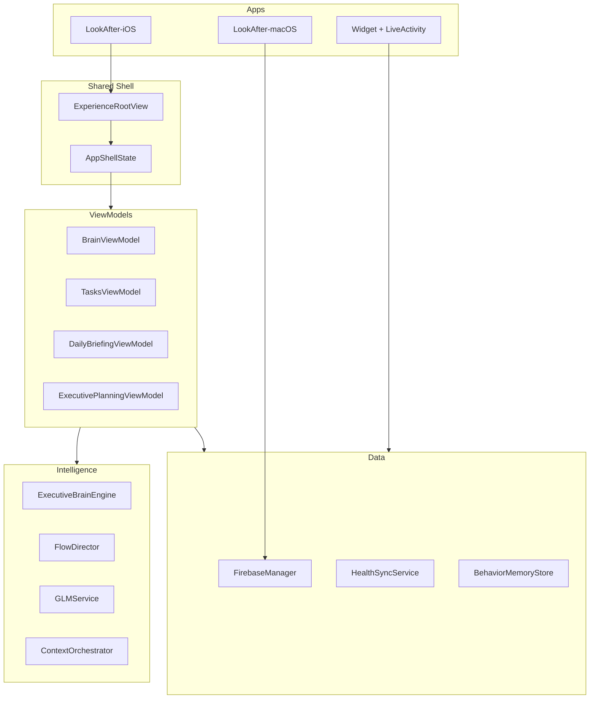

# 1. Test Strategy

**Document ID:** QA-01  
**Parent:** [README.md](README.md)

---

## 1.1 Mission

Ensure LifeOS is **production ready** by validating every feature, interaction, transition, AI decision, data flow, permission, loading state, and recovery scenario across iOS, macOS, and Widget targets.

**Assumptions treated as false until verified:**

- Brain recommendations match current task/health state  
- GLM outputs are schema-valid and grounded  
- Firebase sync is conflict-free  
- HealthKit partial data does not skew capacity  
- Classic and AI Executive modes share identical data  
- Cycle features are correctly gender-gated  

---

## 1.2 Scope

### In scope (v1)

| Area | Details |
|------|---------|
| **Platforms** | iOS 17+ (iPhone primary, iPad layouts), macOS productivity monitor |
| **Targets** | LookAfter-iOS, LookAfter-macOS, LookAfterWidget, Focus Live Activity |
| **Packages** | LookAfterCore, LookAfterAI, LookAfterData, LookAfterFeatures, LookAfterHealth, ExecutiveBrain |
| **Intelligence** | ExecutiveBrainEngine (deterministic), FlowDirector, ContextOrchestrator, GLMService |
| **Integrations** | Firebase Auth + Firestore, HealthKit, EventKit (Calendar), Speech/Microphone |
| **Experience modes** | Classic (`LookAfterMasterCanvas`) and AI Executive (`AIExecutiveCanvas`) |

### Out of scope (v1)

| Area | Reason |
|------|--------|
| Android | Not in codebase |
| watchOS | Future |
| Third-party calendar apps | EventKit only |
| Firebase admin console | Backend ops |
| Non-GLM LLM providers | Single provider today |

---

## 1.3 System Architecture Under Test



**Critical invariant:** `AppShellState` (`Apps/LookAfter-iOS/Experience/AppShellState.swift`) is the single data shell — mode switches must not fork state.

---

## 1.4 Test Personas

| ID | Persona | Profile | Primary flows |
|----|---------|---------|---------------|
| P1 | **New ADHD user** | First install, no HealthKit, no GLM key, completes onboarding | FLOW-001, onboarding, offline briefing |
| P2 | **Power user** | HealthKit + calendar + GLM key + cycle (female) + all modules | FLOW-002–007, planning, insights |
| P3 | **Offline user** | Airplane mode after initial sync | Edge cases §network, inbox queue |
| P4 | **Accessibility user** | VoiceOver, Dynamic Type XXXL, Reduce Motion, High Contrast | [10-accessibility-checklist.md](10-accessibility-checklist.md) |
| P5 | **Cross-device user** | iOS + macOS same Firebase account | MAC flows, productivity sync |

---

## 1.5 Environments

| Env | Hardware | Backend | AI | Use |
|-----|----------|---------|-----|-----|
| **DEV** | Simulator (iPhone 17) | Test Firebase project | Mock or dev GLM key | Daily dev, unit tests |
| **STAGING** | Physical iPhone | Staging Firebase | Rate-limited GLM key | Integration, AI eval |
| **PROD-LIKE** | TestFlight device | Production Firebase rules | Production GLM key | Release candidate soak |

**Build commands:** [build-and-test.md](../build-and-test.md)

```bash
xcodebuild -scheme LookAfter-iOS \
  -destination 'platform=iOS Simulator,name=iPhone 17' \
  build test
```

---

## 1.6 Tooling

| Tool | Purpose |
|------|---------|
| `swift test` | Package unit tests (54 files) |
| `xcodebuild test` | iOS scheme tests |
| Xcode Instruments | Time Profiler, Allocations, Energy, Network |
| Accessibility Inspector | VoiceOver tree, contrast |
| Firebase Emulator | Optional auth/data isolation |
| Manual test logs | Spreadsheet or TestRail — use 22-field template |

**Gap:** No XCUITest suite — UI validation is manual per [04-screen-test-cases.md](04-screen-test-cases.md).

---

## 1.7 Entry Criteria

- Branch builds on iPhone 17 simulator  
- All Tier 1 regression tests pass ([11-regression-suite.md](11-regression-suite.md))  
- Test environment configured (Firebase, optional GLM key)  
- Test devices available for P0 physical checks (HealthKit, Live Activity)  

---

## 1.8 Exit Criteria

- All **P0** test cases pass (100%)  
- No open **S1/S2** defects  
- Production readiness score ≥ **85/100** ([14-production-readiness.md](14-production-readiness.md))  
- AI safety/grounding ≥ **4.0/5.0** on golden set  
- Performance within 10% of targets ([09-performance-benchmarks.md](09-performance-benchmarks.md))  
- QA Lead + Eng Lead + Product sign-off recorded  

---

## 1.9 Test Distribution Target

| Priority | Count | % |
|----------|-------|---|
| P0 | ~45 | 25% |
| P1 | ~80 | 44% |
| P2 | ~55 | 31% |
| **Total** | **~180** | |

Distributed across: [03-module-test-cases.md](03-module-test-cases.md), [04-screen-test-cases.md](04-screen-test-cases.md), [05-flow-test-cases.md](05-flow-test-cases.md), [07-ai-validation.md](07-ai-validation.md), [08-executive-brain-validation.md](08-executive-brain-validation.md).

---

## 1.10 Defect Workflow

1. Log with Test ID, Severity, steps, screenshots/logs  
2. S1/S2 → block release until fixed + retest  
3. Link fix to regression test (unit or new manual ID)  
4. Update [11-regression-suite.md](11-regression-suite.md) if new automation added  

---

## 1.11 Roles

| Role | Responsibility |
|------|----------------|
| QA Lead | Sign-off, readiness score, release checklist |
| QA Engineer | Execute cases, log defects, AI rubric scoring |
| Eng Lead | Fix S1/S2, review brain/AI failures |
| Product | UX 3-second test approval, persona scenarios |
| AI Eval Engineer | Golden dataset maintenance, GLM prompt regressions |

---

## 1.12 References

- Product spec: [ATTENTION_OS_SPEC.md](../ATTENTION_OS_SPEC.md)  
- Onboarding steps: `Apps/LookAfter-iOS/Views/Onboarding/OnboardingView.swift` (`StartStep`)  
- Permissions: `Apps/LookAfter-iOS/Info.plist`  
- Prompts: `Packages/LookAfterAI/Sources/LookAfterAI/Prompts/LookAfterPrompts.swift`  
