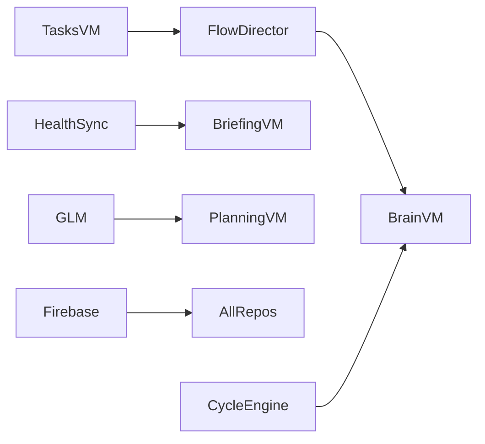

# 13. Risk Assessment

**Document ID:** QA-13  
**Parent:** [README.md](README.md)

FMEA-style risk register for LifeOS production release.

**Scale:** Likelihood (1–5), Impact (1–5), **RPN** = L × I (Risk Priority Number). Mitigate RPN ≥ 15 first.

---

## Critical Risks (RPN ≥ 15)

| ID | Risk | L | I | RPN | Mitigation | Test IDs | Owner |
|----|------|---|---|-----|------------|----------|-------|
| R-001 | Stale hero after task complete/defer | 4 | 5 | 20 | Await orchestrate ordering; single serial queue | LO-IOS-FN-001, FLOW-002 | iOS |
| R-002 | GLM hallucinated schedule mutations | 3 | 5 | 15 | Schema validation; preview before apply; deterministic fallback | LO-AI-AI-001, FLOW-004 | AI |
| R-003 | Health partial data → false Peak capacity | 3 | 5 | 15 | Min sample thresholds; verification UI | LO-DATA-FN-011, LO-IOS-FN-045 | Data |
| R-004 | Firebase auth race on cold launch | 3 | 5 | 15 | Bootstrap guards in ExperienceRootView | FLOW-001, LO-DATA-FN-014 | iOS |
| R-005 | API key exposed in logs/crash reports | 2 | 5 | 10 | Keychain-only; log audit | LO-DATA-SEC-001 | Security |
| R-006 | Factory reset incomplete wipe | 2 | 5 | 10 | FactoryResetManager checklist | FLOW-008, LO-IOS-FN-060 | Data |
| R-007 | Cycle day miscalculation | 3 | 4 | 12 | CycleEngineTests; anchor guards | LO-CORE-FN-050, LO-CORE-FN-051 | Core |
| R-008 | Cross-mode data desync Classic/AI | 2 | 5 | 10 | Shared AppShellState | FLOW-009 | iOS |
| R-009 | Coach unsafe response to distress | 2 | 5 | 10 | Safety rubric; prompt constraints | LO-AI-AI-020 | AI |
| R-010 | Task merge conflict data loss | 2 | 5 | 10 | Merge tests | LO-DATA-FN-001 | Data |

---

## High Risks (RPN 8–14)

| ID | Risk | L | I | RPN | Mitigation | Test IDs |
|----|------|---|---|-----|------------|----------|
| R-011 | GLM timeout hangs UI | 3 | 3 | 9 | AsyncTimeout; cancel UI | LO-DATA-FN-015 |
| R-012 | Calendar permission denied breaks timeline silently | 3 | 3 | 9 | Empty state + explanation | EDGE-P03 |
| R-013 | Onboarding re-shown incorrectly | 2 | 4 | 8 | hasCompletedOnboarding flag | LO-IOS-FN-010 |
| R-014 | Cycle shown to non-female users | 2 | 4 | 8 | CycleFeatureGate | FLOW-019 |
| R-015 | Mid-cycle flow false period reset | 3 | 3 | 9 | shouldTreatFlowAsNewPeriodStart | LO-CORE-FN-051 |
| R-016 | Live Activity stale after kill | 3 | 3 | 9 | Cleanup on launch | FLOW-010 |
| R-017 | Widget shows outdated hero | 3 | 2 | 6 | WidgetSyncService on orchestrate | LO-WGT-FN-001 |
| R-018 | Speech permission denial breaks capture | 4 | 2 | 8 | Text fallback | EDGE-P05 |
| R-019 | Multi-day task duplicate parents | 2 | 4 | 8 | Confirm-before-create | LO-AI-AI-005 |
| R-020 | Behavior memory migration failure | 2 | 4 | 8 | Migrator tests | LO-DATA-FN-012 |

---

## Medium Risks (RPN 4–7)

| ID | Risk | L | I | Mitigation |
|----|------|---|---|------------|
| R-021 | Slow task list with 500+ items | 2 | 3 | Pagination/lazy load |
| R-022 | macOS productivity upload failure | 2 | 2 | Retry queue |
| R-023 | Analytics cache stale insights | 3 | 2 | TTL + manual refresh |
| R-024 | Weather stub always same | 5 | 1 | Document as stub |
| R-025 | Module badge counts stale | 3 | 2 | Refresh on appear |
| R-026 | iPad layout safe area issues | 2 | 2 | EDGE-V12 |
| R-027 | Reduce Motion not fully respected | 2 | 2 | LO-IOS-A11Y-020 |
| R-028 | Offline inbox queue unbounded | 1 | 4 | Queue cap |

---

## Low Risks (RPN ≤ 3)

| ID | Risk | Notes |
|----|------|-------|
| R-029 | Icon asset missing @3x | Visual only |
| R-030 | Coach tone subtle differences | P2 |
| R-031 | Journal export not implemented | Future |
| R-032 | Travel module placeholder data | P2 |

---

## Cross-Module Interaction Risks

| Interaction | Failure mode | Detection |
|-------------|--------------|-----------|
| TasksVM → FlowDirector | Complete without orchestrate | LO-IOS-FN-001 |
| HealthSync → BriefingVM | Sync complete before briefing load | FLOW-005 timing |
| GLM → PlanningVM | Parse error mid-apply | LO-AI-AI-001 |
| CycleEngine → BrainVM | Phase signal stale | FLOW-007 |
| Firebase → Repos | userId mismatch | LO-DATA-SEC-002 |

---

## Risk Response Strategies

| Strategy | When | Example |
|----------|------|---------|
| **Avoid** | Unacceptable impact | No LLM in brain pipeline |
| **Mitigate** | RPN ≥ 15 | Preview before schedule apply |
| **Transfer** | External dependency | Firebase SLA; GLM provider SLA |
| **Accept** | RPN ≤ 6 with monitoring | Weather stub |

---

## Pre-Release Risk Review Agenda

1. Review open defects mapped to R-001–R-010  
2. Confirm mitigations tested this sprint  
3. Waivers require Product + QA Lead signature  
4. Update RPN if new features ship  

---

## Risk Register Change Log

| Date | Change | Author |
|------|--------|--------|
| 2026-08 | Initial register | QA Framework v1.0 |

---

## Monitoring (post-release)

| Risk | Metric | Alert threshold |
|------|--------|-----------------|
| R-001 | Hero tap → wrong task reports | > 0.1% sessions |
| R-002 | Planning apply failures | > 2% attempts |
| R-003 | Capacity override manual reports | > 5/week |
| R-004 | Auth failure rate | > 1% launches |
| R-005 | Crash logs containing "api" patterns | Any match |
