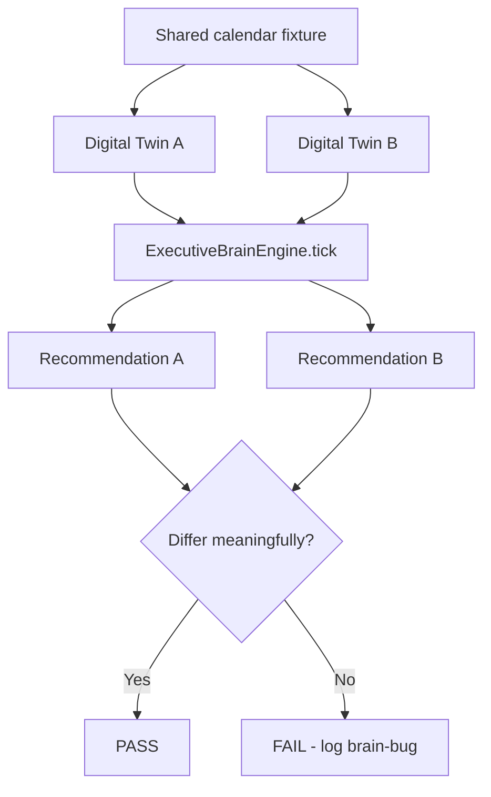

# 17. Digital Twin Validation

**Document ID:** QA-17  
**Parent:** [README.md](README.md)

Validates that recommendations **depend on the user's model** — same calendar, different people, different decisions.

**UI entry:** `HomeManagementView` → `DigitalTwinTabView` (`Packages/LifeOSFeatures/.../HomeManagementView.swift`)  
**Model sources:** `UserLifeProfileStore`, `LifeModelStore`, `StructuredLifeProfileSections`, behavior memory, health calibration

---

## Core invariant

```
Same calendar + same tasks + different Digital Twin  →  different recommendation
```

If recommendations are identical for a morning person vs night owl with the same EventKit data, the twin is **not influencing decisions** — validation fail.

---

## Twin dimensions under test

| Dimension | Source | Affects |
|-----------|--------|---------|
| Peak hours / chronotype | `peakStartHour`, focus preference | Deep work window |
| Work block | Structured schedule | Availability |
| Life commitments | Life model | Immovable anchors |
| ADHD challenge profile | `adhdFocusChallenge` | Intent copy + task type bias |
| Health baseline | HealthKit + calibration | Energy projection |
| Behavior history | Behavior memory | Confidence + slot shift |
| Home / environment | Digital twin tab (routines, inventory) | Context signals |
| Cycle profile | Cycle preferences (female) | Intensity + insight |

---

## Canonical scenarios

### TWIN-001 — Morning person vs night owl

| User | Profile | Same calendar | Expected hero window |
|------|---------|---------------|------------------------|
| **User A** | Peak 8 AM, "morning person" | 9 AM–5 PM meetings; deep work task pending | Deep work **~8 AM** (before meetings) |
| **User B** | Peak 8 PM, "night owl" | Identical calendar | Deep work **~8 PM** (after meetings) |

| Test ID | LO-TWIN-001 |
| Priority | P0 |
| Pass | Hero time window labels differ by ≥4 hours |
| Fail | Same hero slot for A and B |

**Procedure:**

1. Load fixture calendar JSON (identical for both)  
2. Set profile A: `peakStartHour = 8`, focus preference morning  
3. Run `ExecutiveBrainEngine.tick()` or full orchestrate → record hero window  
4. Reset; set profile B: `peakStartHour = 20`  
5. Compare outputs  

### TWIN-002 — ADHD challenge: task initiation vs hyperfocus

| User | `adhdFocusChallenge` | Expected bias |
|------|---------------------|---------------|
| A | Task initiation | Shorter, concrete micro-start hero |
| B | Hyperfocus switching | Break / transition intent after long session |

| Test ID | LO-TWIN-002 |
| Priority | P1 |

### TWIN-003 — Low sleep twin vs rested twin

| User | Sleep last night | Same deadline task |
|------|------------------|-------------------|
| A | 4.5 h | Recovery or small win — not 90 min deep work |
| B | 8 h | Deep work on deadline appropriate |

| Test ID | LO-TWIN-003 |
| Priority | P0 |
| Links | [brain-bugs.md](brain-bugs.md) Issue #12 |

### TWIN-004 — Cycle phase twin (female)

| Phase | Expected |
|-------|----------|
| Follicular | Standard intensity |
| Luteal | Reduced intensity or recovery bias (per product spec) |

| Test ID | LO-TWIN-004 |
| Priority | P1 |
| Gate | `CycleFeatureGate.isEligible` |

### TWIN-005 — Digital twin home routine conflict

| Condition | Home twin: "School pickup 3:30 PM" |
| Expected | No hero deep work spanning 3:15–3:45 |

| Test ID | LO-TWIN-005 |
| Priority | P1 |

---

## Test case table

| ID | Scenario | Priority | Method |
|----|----------|----------|--------|
| LO-TWIN-001 | Morning vs night owl | P0 | Fixture + brain tick |
| LO-TWIN-002 | ADHD challenge profiles | P1 | Side-by-side orchestrate |
| LO-TWIN-003 | Sleep twin | P0 | Health summary inject |
| LO-TWIN-004 | Cycle phase | P1 | CycleEngine + orchestrate |
| LO-TWIN-005 | Home routine block | P1 | Life model + timeline |
| LO-TWIN-006 | Currency/locale (finance module) | P2 | UI only |
| LO-TWIN-007 | Coach tone preference | P2 | GLM copy differs; intent same |
| LO-TWIN-008 | Empty twin (new user) | P1 | Sensible defaults; no crash |

---

## Fixture pairs

Store under `Documentation/qa/fixtures/twin/`:

```
twin/
  calendar_busy_standard.ics.json
  user_a_morning.json
  user_b_night.json
  health_sleep_deprived.json
  health_rested.json
```

Each user fixture includes:

```json
{
  "personaId": "user_a_morning",
  "peakStartHour": 8,
  "focusPreference": "morning",
  "adhdFocusChallenge": "Task initiation",
  "lifeModelRef": "life_model_standard.json"
}
```

---

## Validation workflow



**Meaningful difference defined as:**

- Different hero task ID, **OR**
- Same task but different time window ≥ 30 min, **OR**
- Different intent type (work vs recovery), **OR**
- Different Executive Cost ranking order ([19-executive-cost-validation.md](19-executive-cost-validation.md))

---

## UI validation (DigitalTwinTabView)

| Check | Pass |
|-------|------|
| Twin edits persist across relaunch | ☐ |
| Twin changes trigger context refresh within 5s | ☐ |
| Brain Inspector shows updated signals after twin edit | ☐ |

---

## Failure modes

| Failure | Example |
|---------|---------|
| **Calendar-only brain** | Ignores peak hours |
| **Profile ignored** | Night owl gets 6 AM hero |
| **Stale twin** | Edit twin; hero unchanged until kill app |
| **Cross-user leak** | User B sees User A twin (Firebase bug) |

---

## Release gate

- [ ] LO-TWIN-001 **PASS**  
- [ ] LO-TWIN-003 **PASS**  
- [ ] At least 3 twin pairs documented in fixtures  

---

## Cross-references

- [15-decision-quality-framework.md](15-decision-quality-framework.md) — twin should improve DQS  
- [16-learning-validation.md](16-learning-validation.md) — twin + behavior memory  
- [08-executive-brain-validation.md](08-executive-brain-validation.md) — `WorldStateBuilder` signal audit
