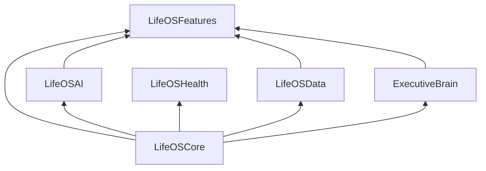

# LifeOS Packages

All folders here are **Swift packages** (each has a `Package.swift`). They are **not** standalone Xcode apps.

## One workspace rule

Open **only** the main project:

```bash
cd /path/to/LifeOS
xcodegen generate
open LifeOS.xcodeproj
```

Or use `LifeOS.code-workspace`.

## Dependency graph



**Rules:** No circular dependencies. `LifeOSCore` is the foundation. `LifeOSFeatures` is the top integration layer for ViewModels.

## Package responsibilities

| Package | Responsibility | Put new code here when… |
|---------|----------------|-------------------------|
| **LifeOSCore** | Domain models, scheduling, semantics, design system, pure logic | It has no I/O and no UI beyond shared design tokens/components |
| **ExecutiveBrain** | Deterministic decision engine (WorldState, Planning, Decision) | It's rule-based brain logic without LLM calls |
| **LifeOSAI** | GLM provider, FlowDirector, prompts, semantic analysis | It calls an LLM or wraps AI inference |
| **LifeOSData** | Persistence, Firebase, repositories, environment signals | It reads/writes storage or syncs to cloud |
| **LifeOSHealth** | HealthKit I/O | It touches HealthKit APIs |
| **LifeOSFeatures** | ViewModels and feature orchestration | It's presentation state for SwiftUI views |

## Internal folder conventions

Each package uses consistent subfolders where applicable:

- `Models/` — Codable domain types
- `Protocols/` — interfaces for DI
- `Repositories/` / `Persistence/` / `Storage/` — I/O (LifeOSData)
- `DesignSystem/` — UI tokens and shared components (LifeOSCore)
- `ViewModels/` — `@MainActor` presentation logic (LifeOSFeatures)
- `Engine/` — deterministic engines (ExecutiveBrain)
- `GLM/` — LLM service and configuration (LifeOSAI)

## Where to put new code

```
SwiftUI view (rendering only)     → Apps/LifeOS-iOS/Views/
ViewModel                           → LifeOSFeatures/<Feature>/ViewModels/
Platform adapter (HealthKit, etc.)  → Apps/LifeOS-iOS/Services/ or LifeOSHealth
Domain model                        → LifeOSCore/Models/
Repository / persistence            → LifeOSData/
LLM prompt or AI call               → LifeOSAI/
Deterministic brain logic           → ExecutiveBrain/
Design token / shared component     → LifeOSCore/DesignSystem/
```

## Command-line tests

```bash
cd Packages/LifeOSCore && swift test
cd Packages/ExecutiveBrain && swift test
cd Packages/LifeOSData && swift test
cd Packages/LifeOSFeatures && swift test
```

## Architecture decisions

See [Documentation/architecture/adr/](../Documentation/architecture/adr/).
